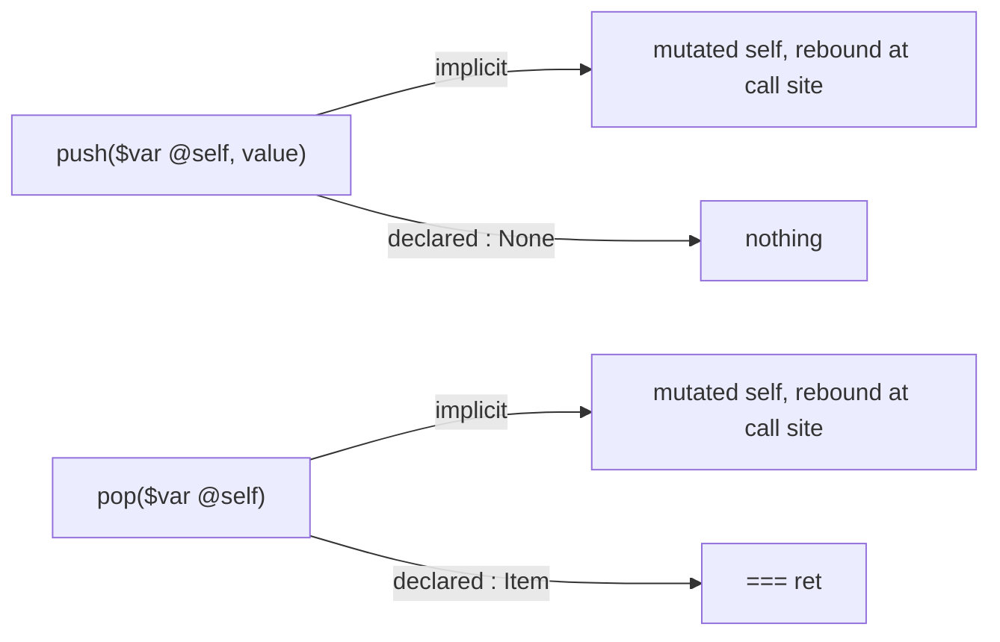

# Oura examples

A set of small programs exercising the Oura language. This file is a reading guide, not a
specification: it covers the parts of the syntax that are hard to recover from the examples
alone, so that a reader can open any `.oura` file here and follow it.

## Files

| File              | Shows                                                 |
| ----------------- | ----------------------------------------------------- |
| `Functions.oura`  | Function and record declaration, the two arrow forms  |
| `Vectors.oura`    | Structs, imports, error unions, trait narrowing       |
| `Dict.oura`       | Listable literals                                     |
| `Player.oura`     | Mutation at the call site, compound assignment        |
| `Exception.oura`  | Error representation as an ABI choice                 |
| `Bounds.oura`     | Dependent refinement traits                           |
| `RandVec.oura`    | Conditional definitions, narrowing a nullable, `main` |
| `SmallStack.oura` | Computed memory layout, small-object optimization     |

## The three sigils

These carry most of the syntax, and each one follows a single rule.

### `$` imports

`$e` binds `head<e> = ref e`. The name comes from the head of the expression, and the binding
is by reference. That one rule covers every use:

```oura
$Dict.Std                  /*/ module:      import Dict from Std
$count                     /*/ field:       count = count
count($self)               /*/ parameter:   self, imported into scope
$var console.IO.Std        /*/ with a modifier
GarbageBytes($size'Bytes'Item)   /*/ named argument: size = ref size'Bytes'Item
Count & ($arr) where this < len'arr   /*/ capture, inside a refinement
```

An optional expression on the left is applied to the value as it is imported. Import then
becomes a checked narrowing, and failure flows to `else`:

```oura
Float32 $(x, y, z) else {
    === DeserializationError
}

if (Vector3 & non'ZERO3) $vec {
    === normalized'vec
}
```

Conversion is not a language feature here — `Float32` is an ordinary function, and the
`operator <name>` form gives such functions their proper name.

`$` was chosen over a `use` keyword purely for length, since parameter lists use it constantly.

### `'` separates a call from its argument

Placing a function next to its argument is already the call — nothing is needed between them.
`'` is only a separator, required just when the argument does not delimit itself:

```oura
count'self          /*/ count(self)
Array'data'self     /*/ Array(data(self))
Count'16            /*/ conversion is a call
ArrayList'Int64     /*/ instantiation is a call
sum[count'list for list in lists]     /*/ no ' — the bracket delimits
write(@console, "…")                  /*/ no ' — the parentheses delimit
```

`[…]` is a Listable, so it also covers generators (`[factoryFunction() for range(0, n)]`).
Member access, conversion and generic instantiation are all just calls, which is why the
language needs no separate syntax for any of them.

Note the direction: you write the goal first and the path to it afterwards. This is deliberate.

### `.` qualifies a module, and nothing else

`.Math` on its own is a module reference. Chaining walks outward to the parent, in the manner of
a domain name, so a fully qualified module may read `.Submodule.Module.Author.org`. `.` is
unrelated to `'` despite both reading rightward.

## Mutation

A writable binding is declared `var`, whether it is a local, a field or a parameter:

```oura
acc = var 0
_count : var Unsigned64
hurt(targetPlayer : var Player, amount : Real) => { … }
```

`vol` is the separate case where writes arrive from outside — another thread, a device, anything
the compiler cannot see — so every access must be re-checked:

```oura
vol deviceRandom
```

The two are orthogonal. `vol` does not imply writable, since plenty of volatile values are
read-only, a hardware random source among them; a binding that is both is `var vol`. Readers
coming from C should note the inversion: there `volatile int` is writable and `const volatile`
is needed for the read-only case, whereas here read-only is the default.

The two split at the limit of inference. Where a `var` write becomes observable follows from the
kind of binding it is: a field is visible to whoever holds the struct, a `var` parameter is
rebound at the call site. `vol` is the part that cannot be derived, which is why it is the only
other keyword. On a function, `var` marks outbound effects (`main var => …`) while a `$vol`
parameter declares an inbound one, giving effect declaration in both directions.

`@` marks a read-modify-write, both on assignment and at a call site:

```oura
@health'targetPlayer - amount   /*/ health'targetPlayer = health'targetPlayer - amount
@count'self + 1
hurt(@target, strength'attacker)
```

A plain `=` overwrites and needs no `@`; `data'self = PreallocBuffer'oldItems` is not a
compound assignment. A parameter that will be mutated is declared `$var @self`, so the marker
appears on both sides of the call and can be checked rather than merely conventional.

There are no callee-side references. A mutating call passes values in and returns them out, and
the call site rebinds them — `Player.oura` spells the desugaring out in full:

```oura
attack(@myPlayer, @otherPlayer)
/*/ EXPLICIT: (@myPlayer = attacker, @otherPlayer = target)
/*/             = attack(attacker = myPlayer, target = otherPlayer)
```

This is what makes handing out a raw `PreallocBuffer` tractable: aliasing never arises, so
lifetimes are a question about escaping return values only.

### Two return channels

Mutated arguments return implicitly. The declared return type is a separate channel, carrying
only genuinely new values — which is why every mutator below declares `: None`:



`===` returns. It can name its frame, which gives a labelled return out of a nested block:

```oura
n = Int64'read(@console, Int64) else alt = {
    write(@console, "Invalid input; assuming n=0\n")
    alt === 0
}
```

Because `===` names the return slot, it doubles as a lifetime anchor. `on self` binds a result
to the lifetime of `self`; `on(===)` binds it to the returned value:

```oura
item($self, index : Index) => : Item on self
items($self on(===)) => items'data'self
```

`out` is reserved for destructive moves and is not yet used in these examples.

## The two arrows

`->` builds a lambda, and so also spells the type of a field holding one. `=>` defines a named
function, and is purely shorthand for assigning a lambda to a name:

```oura
terseFunc(a : Real, b : Real) => a + b     /*/ same thing as …
terseFunc = (a : Real, b : Real) -> a + b  /*/ … this

f : (Real, Int) -> : Real                  /*/ a field holding a lambda
g(Real, Count) => : Real                   /*/ the same declaration, shortened
(vol -> : ArrayList'Int64) $factoryFunction    /*/ a function type
```

There are therefore no methods, and no dispatch mechanism separate from ordinary values — a
function is a field like any other. `ImplRecord` in `Functions.oura` fills its three slots three
different ways on purpose: a lambda into a lambda-typed field, a lambda into a slot declared
with `=>`, and a named definition.

Everything between the parameter list and the arrow qualifies the function itself, and stays
there under either spelling:

```oura
main var => { … }             /*/ same thing as …
main = () var -> { … }        /*/ … this — var qualifies the function, not the binding

pop($var @self) where self is non'Empty => : Item
```

So that region carries `var` for outbound effects, `where` for constraints and `: T` for the
return trait, while a `var` inside a type (`_count : var Unsigned64`) is the unrelated,
writable-binding sense.

A body in braces returns with `===`, and may name its result trait first
(`pop($var @self) => Item{ … }`).

## Traits and refinements

`proto` introduces a prototype and `&` intersects. A trait may be refined with `where`, and the
refinement may depend on a value, which is how bounds checking is expressed as a type:

```oura
Index = Unsigned64 where this < count
Empty = self where count'self ?= 0

Index(arr : ref IntList) => Count & ($arr) where this < len'arr
safeItem(arr : IntList, ind : Index'arr) => reservedBuffer(arr, ind)
```

`?=` compares; `=` binds.

A leading `_` marks a member private at its declaration. References to it drop the underscore,
so `_ensureCapacity` is called as `ensureCapacity` and `_UsingSmall` is used as `UsingSmall`.

## Two ideas worth knowing about

**Memory layout is a computed type.** `SmallStack._PreallocBuffer` selects its layout through a
type-level `if` over a refinement, so small-object optimization is expressed in the language
rather than through an unsafe union or a compiler intrinsic:

```oura
_UsingSmall = self where capacity <= SMALL_COUNT

_PreallocBuffer = proto (
    struct Array(Item, SMALL_COUNT) if self is UsingSmall
    else Array(Item, count) & GarbageBytes(size = size'Bytes'Item * (capacity-count))
)
```

Since the layout depends on `count` and `capacity`, changing either invalidates the buffer. The
examples mark those points explicitly:

```oura
@count'self + 1 /*/ invalidates data'self
data'self = PreallocBuffer'concat(oldItems, value)
```

**Error representation is an ABI parameter.** Errors are ordinary union returns (`Int32|OutOfBoundsError`),
but how an error travels is a library choice rather than a language rule:

```oura
Exceptional(E : Any) => proto ABIMod((storage = CatchStack), E)
Unexpected(E : Any)  => proto ABIMod((storage = CatchLookUp), E)
```

Unwinding, a lookup table, or something else can be selected per error type without the source
syntax changing.

## Comments

```oura
/* block, closed with two stars **/
/*/ to end of line
```

## Open questions

- Ownership: `out` destructive moves unwritten, so how a raw `PreallocBuffer` is safely handed out is still implicit
