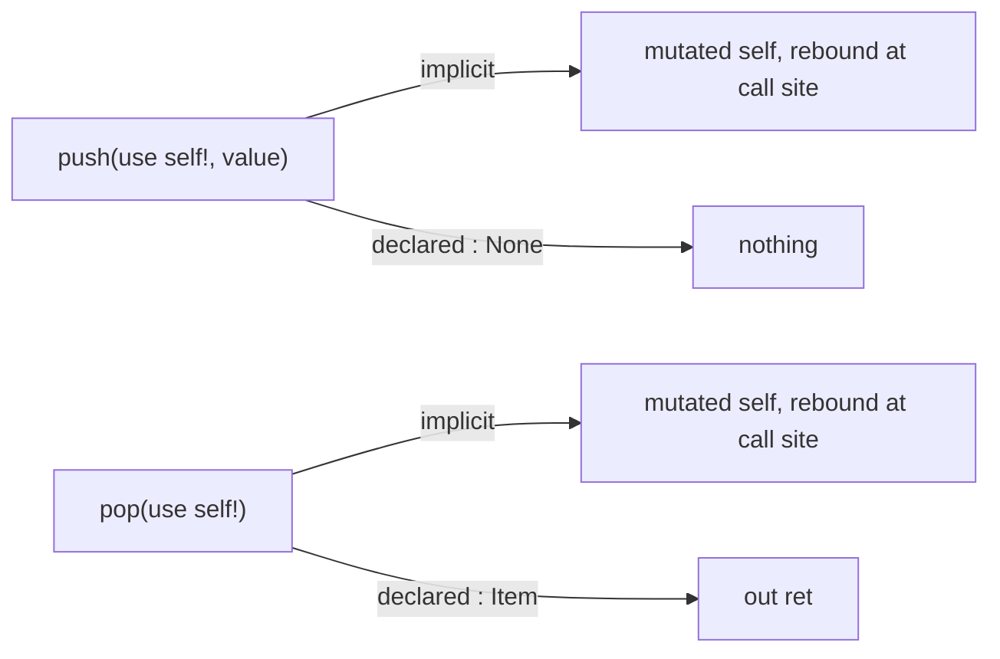

# Oura examples

A set of small programs exercising the Oura language. This file is a reading guide, not a
specification: it covers the parts of the syntax that are hard to recover from the examples
alone, so that a reader can open any `.oura` file here and follow it.

## Files

| File              | Shows                                                 |
| ----------------- | ----------------------------------------------------- |
| `Functions.oura`  | Function and record declaration, the two arrow forms  |
| `Vectors.oura`    | Structs, imports, error unions, trait narrowing       |
| `Dict.oura`       | Listable literals                                     |
| `Player.oura`     | Mutation at the call site, compound assignment        |
| `Exception.oura`  | Error representation as an ABI choice                 |
| `Bounds.oura`     | Dependent refinement traits                           |
| `RandVec.oura`    | Conditional definitions, narrowing a nullable, `main` |
| `SmallStack.oura` | Computed memory layout, small-object optimization     |
| `Ownership.oura`  | Ownership transfer, borrowing, release                |

## Imports, calls and modules

These three carry most of the syntax, and each one follows a single rule.

### `use` imports

`use e` binds `head<e> = @e`. The name comes from the head of the expression, and the binding
is by reference. That one rule covers every use:

```oura
use Dict mod Std              /*/ module:      import Dict from Std
use count                     /*/ field:       count = count
count(use self)               /*/ parameter:   self, imported into scope
use ex console! mod IO.Std        /*/ with modifiers
GarbageBytes(use size'Bytes'Item)   /*/ named argument: size = @size'Bytes'Item
Count & (use arr) where this < len'arr   /*/ capture, inside a refinement
```

`use count` is the binding `count = count` with the redundant half elided, so the full spelling is
always available and means the same thing. A named argument is written `size = size'Bytes'Item`
in full and `use size'Bytes'Item` when the two halves agree, and a condition that tries a binding
under a name of its own — `if frontInd = Index(vec, 0)` in `RandVec.oura` — is the same
construct spelled out. The keyword marks the elision; it does not perform the binding, which
is why it is not itself `=`.

In a parameter list it does the same job, and there it pairs with `!`, which is a separate
marker on its own axis. `use` says the parameter binds from a name already in scope; `!` says the
callee reads and writes it. The two combine freely, and a parameter carrying neither consumes what
it is given:

```oura
count(use self)                        /*/ imported, read-only
operator rel(use self!)                /*/ imported, read-modify-write
hurt(targetPlayer! : Player, …)        /*/ fresh name, read-modify-write
resized(block from(out), …)            /*/ fresh name, consumed
```

A receiver always comes from the enclosing scope, so a mutating method takes `use self!` and never
a bare `self!`. A `given` or `with` block can supply it once for everything inside it, which is why
the methods of `AnyStack` declare no receiver of their own.

An optional expression may be applied to the value as it is imported, written after `as`. Import
then becomes a checked narrowing, and failure flows to `else`:

```oura
use (x, y, z) as Float32 else {
    out DeserializationError
}

if use vec as Vector3 & non'ZERO3 {
    out normalized'vec
}

if use ind1 as Index'arr, use ind2 as Index'arr {
    …
}
```

Because `as` is a keyword rather than a sigil, the trait from its right composes with `&` and needs
no parentheses, and the value stays in front of the trait that qualifies it — the same order as
`x : T`.

Conversion is not a language feature here — `Float32` is an ordinary function, and the
`operator new <name>` form gives such functions their proper name.

`use` is a word rather than a sigil because it reads the same way at every one of these sites: a
name standing in for the value bound to it elsewhere. That is what an import is here (a definition
whose right side repeats its left, and so need not be written twice), and a `use` parameter makes
the same claim about an argument.

### `'` separates a call from its argument

Placing a function next to its argument is already the call — nothing is needed between them.
`'` is only a separator, required just when the argument does not delimit itself:

```oura
count'self          /*/ count(self)
Array'data'self     /*/ Array(data(self))
Count'16            /*/ conversion is a call
ArrayList'Int64     /*/ instantiation is a call
sum[count'list for list in lists]     /*/ no ' — the bracket delimits
write(console!, "…")                  /*/ no ' — the parentheses delimit
```

`[…]` is a Listable, so it also covers generators (`[factoryFunction() for range(0, n)]`).
Member access, conversion and generic instantiation are all just calls, which is why the
language needs no separate syntax for any of them.

Note the direction: you write the goal first and the path to it afterwards. This is deliberate.

### `mod` marks a module

`mod` is what tells a module apart from an ordinary name, and `.` chains one outward to its
parent, in the manner of a domain name, so a fully qualified module reads
`mod Submodule.Module.Author.org`. `.` qualifies modules and nothing else, and is unrelated to
`'` despite both reading rightward.

Once marked, a module is a value like any other, so qualifying a call is simply passing one:

```oura
use Dict mod Std                     /*/ import Dict from Std
use mod Math.Std                     /*/ import the module itself
use (TextStream, DeserializationError) mod IO.Std
sqrt(mod Math, x'vec^2 + y'vec^2)    /*/ the Math sqrt, not whichever is in scope
```

## Mutation

A local in a procedural scope declares itself writable, and `!` is that declaration:

```oura
acc! = 0
```

A field declares nothing. Writability belongs to the record holding it rather than to the field, so
there is no per-field feature to reach for, and `_data : Buffer'Item` needs no marker to be written
later. Both kinds still carry `!` at every write, which the `!` section below covers in full.

`ex` is the separate case: the binding is *exposed*, meaning something the declaration does not
name may write it — a device, the operating system, another agent entirely.

```oura
ex deviceRandom
```

The two are orthogonal, and each carries exactly one fact. `!` says *this* code writes here;
`ex` says *another* name may:

|                  | no other writer   | another writer exists  |
| ---------------- | ----------------- | ---------------------- |
| this code reads  | *(default)*       | `ex`                   |
| this code writes | `!` at each write | `ex`, and `!` likewise |

A hardware random source is `ex` and carries no `!` anywhere — it changes under you, and you have
no write of your own to mark. A control register a device also drives is `ex` with `!` at each of
your writes. Since an exposed value may change between one access and the next, it cannot be
cached across them; that follows from the exposure rather than being a second thing to declare.

Two neighbouring ideas this is not. It is not C's `volatile`, which describes what the compiler
must do — reload, and keep accesses in order — rather than who else can write, and which offers
nothing against a concurrent writer. And it is not Python's `global`, which names a *scope*: a
global is still written only by code that can be seen. `ex` names an agent that cannot.

### `ex to`

Left bare, `ex` names no writer and so admits any. The writers may instead be listed, narrowing
the claim to exactly them:

```oura
_health : Real ex to hurt
```

Both fields and functions may be listed. Naming a function says that function may write the
binding; naming a field says that field holds a reference to it which the ownership rules do not
track. Privacy therefore stops being binary — `_` closes a member and `ex to` reopens it to a
named set. The compiler checks the list rather than trusting it, though the rules governing it
are not settled yet.

### Effects in both directions

The marker and the keyword split at the limit of inference. Where a write becomes observable
follows from the kind of place it is: a field is visible to whoever holds the struct, an `!`
parameter is rebound at the call site. `ex` is the part that cannot be derived, which is why it is
the only keyword left here. On a function, the `!` parameters carry the outbound effects and `ex`
marks the inbound ones:

```oura
main ex => { … }
```

`main` is `ex` because its result is shaped by forces its signature does not name: the OS, the
environment, whatever the process is handed. The meaning is the one above, applied to the
returned value, and it is what permits the body to reach bindings it never captured and to call
exposed functions at all. A `use ex` parameter declares the inbound effect for a single argument
instead of for the whole function.

`!` marks a writable place. Every write to one carries it, so the marker is on the page at each
point a value changes, whether the write comes from an assignment or from a call:

```oura
acc! = 0                        /*/ declares a writable local
health'targetPlayer! = 0        /*/ overwrites it
health'targetPlayer! - amount   /*/ health'targetPlayer = health'targetPlayer - amount
count'self! + 1
hurt(target!, strength'attacker)
```

What follows the place decides which kind of write it is: an operator reads the old value and folds
the new one into it, while a bare `=` replaces it outright. Both are writes, so both are marked.
A declaration is the first `x! = v` in a scope and an overwrite is any later one, which is the
only thing distinguishing the two.

An indexed write marks the container rather than the place inside it, since the container is what
changes. That keeps it identical to any other mutating call, with the marker on the argument the
callee writes:

```oura
item(data'self!, index) = value       /*/ operator item=(use self!, …)
items(data'grown!, range(0, n)) = rel items'block
hurt(target!, strength'attacker)
```

`!` follows a whole access chain, member accesses included, and it then takes the entire chain
rather than the name it touches: `count'self! + 1` marks `count'self`, not `self`. That is the form
every field write above uses, which is why none of them carries a marker deeper in the path.

An unmarked `=` is therefore always a binding, never a write. `oldItems = rel data'self` binds a
new name, and a binding declared with a trait and filled once on each path afterwards is still a
binding, so `Bounds.sum2Items` leaves both of its `res = …` unmarked:

```oura
res : Int32|OutOfBoundsError            /*/ deferred init, not a writable place

if use ind1 as Index'arr, use ind2 as Index'arr {
    res = safeItem(arr, ind1) + safeItem(arr, ind2)
} else {
    res = OutOfBoundsError
}
```

A parameter that will be mutated is declared `targetPlayer!`. What `!` does not do is import, so a
receiver still needs `use self!`. The marker appears from both sides of the call and can be checked
rather than merely conventional.

There are no callee-side references. A mutating call passes values in and returns them out, and
the call site rebinds them — `Player.oura` spells the desugaring out in full:

```oura
attack(myPlayer!, otherPlayer!)
/*/ EXPLICIT: (myPlayer! = attacker, otherPlayer! = target)
/*/             = attack(attacker = myPlayer, target = otherPlayer)
```

This is what makes handing out a raw `PreallocBuffer` tractable: aliasing never arises, so
lifetimes are a question about escaping return values only.

### Two return channels

Mutated arguments return implicitly. The declared return type is a separate channel, carrying
only genuinely new values — which is why every mutator below declares `: None`:



`out` returns. It can name its frame, which gives a labelled return out of a nested block:

```oura
n = result'read(console!, Int64) else alt = {
    write(console!, "Invalid input; assuming n=0\n")
    alt out 0
}
```

`else` comes in two forms, and the `=` is what separates them. `else = v` supplies a fallback
*value* for the binding that failed; `else { … }` runs a block instead, which has to leave by
itself. A block may name its frame first (`else alt = { … }`), and then `alt out v` leaves it with
a value, which covers the case above: a fallback value that has to be computed.

```oura
n = result'read(console!, Int64) else = 0        /*/ fallback value
use factoryFunction as (ex -> : ArrayList'Int64) else {
    write(console!, "factoryFunction not defined!\n")
    main out 0                                  /*/ fallback block, leaves by itself
}
```

Because `out` names the return slot, it doubles as a lifetime anchor: `from(out)` refers to the
returned value, which is what the next section is built from.

## Ownership

Copying is the default. A parameter consumes the value it is given, but what the caller hands
over is a copy, so the caller's binding survives the call untouched.

`rel` (release) marks an expression whose value is destroyed where it is used, handing the storage over
instead of duplicating it. It is an elision marker rather than a safety mechanism, and it plays
the same role for destruction that `!` plays for read-modify-write — it appears only at use
sites, never in a declaration:

```oura
b = a                       /*/ a copy — two blocks, so two teardowns
c = rel a                   /*/ a move — `a` is gone, and only one teardown runs
big = resized(rel c, 64)
```

`@` is the third answer, and it aliases: the binding refers to a value owned somewhere else
instead of holding one of its own. It reads the same way in a type and on a value:

```oura
_tail : @ListNode from head'self | None   /*/ the field refers, it does not own
cur! : ListNode = @head'self              /*/ the binding aliases, it does not copy
```

So `b = a` copies, `c = rel a` moves and `cur! = @head'self` aliases. The three are told apart where
the value arrives, rather than from the declaration alone.

`from` is the counterpart, and appears only in declarations. It is what lets a value outlive the
call it was passed to, and it names where the value comes to live:

```oura
item(use self, index : Index) => : Item from self       /*/ result lives in a parameter
items(use self from(out)) => items'data'self            /*/ result lives in the returned value
resized(block from(out), newCapacity : Count)        /*/ the argument lives in the result
Surface(width : Count, height : Count, block from pixels(out))   /*/ … in a named slot of it
```

So a signature says what becomes of each argument, and the call site says which of them it is
willing to give up. Between them, handing out a raw buffer is checked rather than conventional —
`SmallStack` marks every point where it does so:

```oura
oldItems = rel data'self
count'self! + 1 /*/ invalidates data'self
data'self! = concat[rel oldItems, [value]]
```

`operator rel` is teardown, named after the use-site marker in the same way `operator item=` is
named after `item(x!) = v`. It runs where a binding dies unmoved, and a `rel` use suppresses it:

```oura
operator rel(use self!) => {
    free(rel data'self)
}
```

## The two arrows

`->` builds a lambda, and so also spells the type of a field holding one. `=>` defines a named
function, and is purely shorthand for assigning a lambda to a name:

```oura
terseFunc(a : Real, b : Real) => a + b     /*/ same thing as …
terseFunc = (a : Real, b : Real) -> a + b  /*/ … this

f : (Real, Int) -> : Real                  /*/ a field holding a lambda
g(Real, Count) => : Real                   /*/ the same declaration, shortened
use factoryFunction as (ex -> : ArrayList'Int64)  /*/ a function type
```

There are therefore no methods, and no dispatch mechanism separate from ordinary values — a
function is a field like any other. `ImplRecord` in `Functions.oura` fills its three slots three
different ways from purpose: a lambda into a lambda-typed field, a lambda into a slot declared
with `=>`, and a named definition.

Everything between the parameter list and the arrow qualifies the function itself, and stays
there under either spelling:

```oura
main ex => { … }        /*/ same thing as …
main = () ex -> { … }   /*/ … this — ex qualifies the function, not the binding

pop(use self!) where self is non'Empty => : Item
```

So that region carries `ex` for inbound effects, `where` for constraints and `: T` for the return
trait.

A body in braces returns with `out`, and may name its result trait first
(`pop(use self!) => Item{ … }`).

### `operator`

`operator` defines a function reached by syntax rather than by its own name. The name that
follows is the syntax it answers to:

```oura
operator rel(use self!) => { … }                                   /*/ rel x
operator item=(use self!, index : Index, value : Item) => : None   /*/ item(x!, i) = v
operator new SmallStack(list : Listable) => …                      /*/ SmallStack'list
```

`new` is the marker for the one case where the syntax *is* a name — construction and conversion,
which are the same operation here, since `SmallStack'list` is an ordinary call. Without it the
constructor would be indistinguishable from an operator named after a form that happens to be a
bare identifier, and that ambiguity is the only reason the marker exists. Everything else keeps
its use-site spelling verbatim, so no operator needs quoting.

## Traits and refinements

`proto` introduces a prototype and `&` intersects. A trait may be refined with `where`, and the
refinement may depend from a value, which is how bounds checking is expressed as a type:

```oura
Index = Unsigned64 where this < count
Empty = self where count'self ?= 0

Index(arr : @IntList) => Count & (use arr) where this < len'arr
safeItem(arr : IntList, ind : Index'arr) => reservedBuffer(arr, ind)
```

`?=` compares and `!=` denies it; `=` binds; `use` binds a name to itself.

A leading `_` marks a member private at its declaration. References to it drop the underscore,
so `_ensureCapacity` is called as `ensureCapacity` and `_UsingSmall` is used as `UsingSmall`.

## Two ideas worth knowing about

**Memory layout is a computed type.** `SmallStack._PreallocBuffer` selects its layout through a
type-level `if` over a refinement, so small-object optimization is expressed in the language
rather than through an unsafe union or a compiler intrinsic:

```oura
_UsingSmall = self where capacity <= SMALL_COUNT

_PreallocBuffer = proto (
    struct Array(Item, SMALL_COUNT) if self is UsingSmall
    else Array(Item, count) & GarbageBytes(size = size'Bytes'Item * (capacity-count))
)
```

Since the layout depends from `count` and `capacity`, changing either invalidates the buffer. The
examples mark those points explicitly:

```oura
count'self! + 1 /*/ invalidates data'self
data'self! = concat[rel oldItems, [value]]
```

**Error representation is an ABI parameter.** Errors are ordinary union returns (`Int32|OutOfBoundsError`),
but how an error travels is a library choice rather than a language rule:

```oura
Exceptional(E : Any) => proto E #CatchStack
Unexpected(E : Any)  => proto E #CatchLookUp
```

Unwinding, a lookup table, or something else can be selected per error type without the source
syntax changing.

## Comments

```oura
/* block, closed with two stars **/
/*/ to end of line
```

## Open questions

- `as` operand order: the value is from the left here, but a catch-style binding would want the
  trait there instead (`else Exception as e`)
- Precedence of `rel` beside `'`: the examples write `rel data'self`, leaving `Array'rel data'self` unsettled
- Copying: whether the deep copy of a struct that owns storage is automatic, or a hook such as `operator new Block(Block)`
- Partial moves: `SmallStack.pop` moves a prefix out of the buffer and drops the rest, so one `rel` covers two fates
- `ex to` checking rules: what a listed writer is permitted to do, and how a listed field's untracked reference is verified
- Which mention carries `!` in a field write: the tail of the chain (`data'self!`, as written
  throughout) or the field that actually changes (`data!'self`), given that an indexed write marks
  its container
- `!` beside `!=`: `data'self! = v` and `data'self != v` are separated by one space, so either the
  denial operator moves off `!` or the spacing becomes significant
