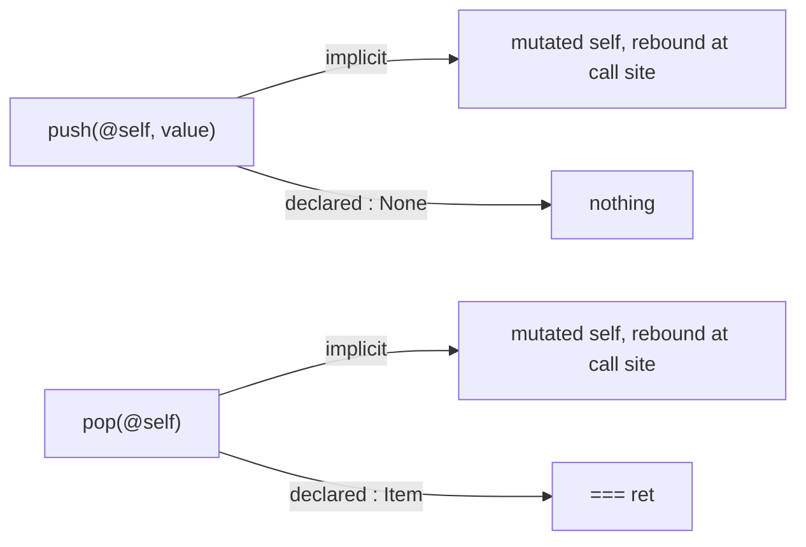

# Oura examples

A set of small programs exercising the Oura language. This file is a reading guide, not a
specification: it covers the parts of the syntax that are hard to recover from the examples
alone, so that a reader can open any `.oura` file here and follow it.

## Files

| File              | Shows                                                 |
| ----------------- | ----------------------------------------------------- |
| `Functions.oura`  | Function and record declaration, the two arrow forms  |
| `Vectors.oura`    | Structs, imports, error unions, trait narrowing       |
| `Dict.oura`       | Listable literals                                     |
| `Player.oura`     | Mutation at the call site, compound assignment        |
| `Exception.oura`  | Error representation as an ABI choice                 |
| `Bounds.oura`     | Dependent refinement traits                           |
| `RandVec.oura`    | Conditional definitions, narrowing a nullable, `main` |
| `SmallStack.oura` | Computed memory layout, small-object optimization     |
| `Ownership.oura`  | Ownership transfer, borrowing, release                |

## Imports, calls and modules

These three carry most of the syntax, and each one follows a single rule.

### `$` imports

`$e` binds `head<e> = ref e`. The name comes from the head of the expression, and the binding
is by reference. That one rule covers every use:

```oura
$Dict.Std                  /*/ module:      import Dict from Std
$count                     /*/ field:       count = count
count($self)               /*/ parameter:   self, imported into scope
$var console mod IO.Std        /*/ with a modifier
GarbageBytes($size'Bytes'Item)   /*/ named argument: size = ref size'Bytes'Item
Count & ($arr) where this < len'arr   /*/ capture, inside a refinement
```

`$count` is the binding `count = count` with the redundant half elided, so the full spelling is
always available and means the same thing. A named argument is written `size = size'Bytes'Item`
in full and `$size'Bytes'Item` when the two halves agree, and a condition that tries a binding
under a name of its own — `if frontInd = Index(vec, 0)` in `RandVec.oura` — is the same
construct spelled out. The sigil marks the elision; it does not perform the binding, which is
why it is not itself `=`.

In a parameter list it does a second job as well, and there it pairs with `@`: `$self` is
borrowed, `@self` is read-modify-write, and a bare `self` consumes. Those are three parameter
modes rather than three kinds of assignment, so the marker for the first is a sigil like the
marker for the second.

An optional expression may be applied to the value as it is imported, written after `as`. Import
then becomes a checked narrowing, and failure flows to `else`:

```oura
$(x, y, z) as Float32 else {
    === DeserializationError
}

if $vec as Vector3 & non'ZERO3 {
    === normalized'vec
}

if $ind1 as Index'arr, $ind2 as Index'arr {
    …
}
```

Because `as` is a keyword rather than a sigil, the trait on its right composes with `&` and needs
no parentheses, and the value stays in front of the trait that qualifies it — the same order as
`x : T`.

Conversion is not a language feature here — `Float32` is an ordinary function, and the
`operator new <name>` form gives such functions their proper name.

`$` was chosen over a `use` keyword partly for length, since parameter lists use it constantly,
and it carries the meaning it already has in a shell and in a Rust macro pattern: a name standing
in for the value bound to it elsewhere. That is what an import is here — a definition whose right
side repeats its left, and so need not be written twice.

### `'` separates a call from its argument

Placing a function next to its argument is already the call — nothing is needed between them.
`'` is only a separator, required just when the argument does not delimit itself:

```oura
count'self          /*/ count(self)
Array'data'self     /*/ Array(data(self))
Count'16            /*/ conversion is a call
ArrayList'Int64     /*/ instantiation is a call
sum[count'list for list in lists]     /*/ no ' — the bracket delimits
write(@console, "…")                  /*/ no ' — the parentheses delimit
```

`[…]` is a Listable, so it also covers generators (`[factoryFunction() for range(0, n)]`).
Member access, conversion and generic instantiation are all just calls, which is why the
language needs no separate syntax for any of them.

Note the direction: you write the goal first and the path to it afterwards. This is deliberate.

### `.` qualifies a module, and nothing else

`.Math` on its own is a module reference. Chaining walks outward to the parent, in the manner of
a domain name, so a fully qualified module may read ` mod Submodule.Module.Author.org`. `.` is
unrelated to `'` despite both reading rightward.

## Mutation

A writable binding is declared `var`, whether it is a local, a field or a parameter:

```oura
acc = var 0
_count : var Unsigned64
hurt(targetPlayer : var Player, amount : Real) => { … }
```

`ex` is the separate case: the binding is *exposed*, meaning something the declaration does not
name may write it — a device, the operating system, another agent entirely.

```oura
ex deviceRandom
```

The two are orthogonal, and each carries exactly one fact. `var` says *this* name may write;
`ex` says *another* one may:

|           | no other writer | another writer exists |
| --------- | --------------- | --------------------- |
| read-only | *(default)*     | `ex`                  |
| writable  | `var`           | `var ex`              |

A hardware random source is `ex` and not `var` — it changes under you, but you cannot write it.
A control register a device also drives is `var ex`. Since an exposed value may change between
one access and the next, it cannot be cached across them; that follows from the exposure rather
than being a second thing to declare.

Two neighbouring ideas this is not. It is not C's `volatile`, which describes what the compiler
must do — reload, and keep accesses in order — rather than who else can write, and which offers
nothing against a concurrent writer. And it is not Python's `global`, which names a *scope*: a
global is still written only by code that can be seen. `ex` names an agent that cannot.

### `ex to`

Left bare, `ex` names no writer and so admits any. The writers may instead be listed, narrowing
the claim to exactly them:

```oura
_health : var Real ex to hurt
```

Both fields and functions may be listed. Naming a function says that function may write the
binding; naming a field says that field holds a reference to it which the ownership rules do not
track. Privacy therefore stops being binary — `_` closes a member and `ex to` reopens it to a
named set. The compiler checks the list rather than trusting it, though the rules governing it
are not settled yet.

### Effects in both directions

The two keywords split at the limit of inference. Where a `var` write becomes observable follows
from the kind of binding it is: a field is visible to whoever holds the struct, a `var` parameter
is rebound at the call site. `ex` is the part that cannot be derived, which is why it is the
only other keyword. On a function, `var` marks outbound effects and `ex` inbound ones:

```oura
main var ex => { … }
```

`main` is `ex` because its result is shaped by forces its signature does not name: the OS, the
environment, whatever the process is handed. The meaning is the one above, applied to the
returned value, and it is what permits the body to reach bindings it never captured and to call
exposed functions at all. A `$ex` parameter declares the inbound effect for a single argument
instead of for the whole function.

`@` marks a read-modify-write, both on assignment and at a call site:

```oura
@health'targetPlayer - amount   /*/ health'targetPlayer = health'targetPlayer - amount
@count'self + 1
hurt(@target, strength'attacker)
```

A plain `=` overwrites and needs no `@`; `data'self = PreallocBuffer'oldItems` is not a
compound assignment. A parameter that will be mutated is declared `@self`, with no `$` and no
`var`: `@` already carries both, since a read-modify-write parameter must be bound by name and
must be writable. So the marker appears on both sides of the call and can be checked rather than
merely conventional.

There are no callee-side references. A mutating call passes values in and returns them out, and
the call site rebinds them — `Player.oura` spells the desugaring out in full:

```oura
attack(@myPlayer, @otherPlayer)
/*/ EXPLICIT: (@myPlayer = attacker, @otherPlayer = target)
/*/             = attack(attacker = myPlayer, target = otherPlayer)
```

This is what makes handing out a raw `PreallocBuffer` tractable: aliasing never arises, so
lifetimes are a question about escaping return values only.

### Two return channels

Mutated arguments return implicitly. The declared return type is a separate channel, carrying
only genuinely new values — which is why every mutator below declares `: None`:



`===` returns. It can name its frame, which gives a labelled return out of a nested block:

```oura
n = Int64'read(@console, Int64) else = alt = {
    write(@console, "Invalid input; assuming n=0\n")
    alt === 0
}
```

`else` comes in two forms, and the `=` is what separates them. `else = v` supplies a fallback
*value* for the binding that failed; `else { … }` runs a block instead, which has to leave by
itself. Above, the fallback value is computed by a block, so both appear at once — `= alt = {`
reads as "fall back to the value of the frame `alt`":

```oura
n = Int64'read(@console, Int64) else = 0        /*/ fallback value
$factoryFunction as (ex -> : ArrayList'Int64) else {
    write(@console, "factoryFunction not defined!\n")
    main === 0                                  /*/ fallback block, leaves by itself
}
```

Because `===` names the return slot, it doubles as a lifetime anchor: `on(===)` refers to the
returned value, which is what the next section is built on.

## Ownership

Copying is the default. A parameter consumes the value it is given, but what the caller hands
over is a copy, so the caller's binding survives the call untouched.

`out` marks an expression whose value is destroyed where it is used, handing the storage over
instead of duplicating it. It is an elision marker rather than a safety mechanism, and it plays
the same role for destruction that `@` plays for read-modify-write — it appears only at use
sites, never in a declaration:

```oura
b = a                       /*/ a copy — two blocks, so two teardowns
c = out a                   /*/ a move — `a` is gone, and only one teardown runs
big = resized(out c, 64)
```

`on` is the counterpart, and appears only in declarations. It is what lets a value outlive the
call it was passed to, and it names where the value comes to live:

```oura
item($self, index : Index) => : Item on self       /*/ result lives in a parameter
items($self on(===)) => items'data'self            /*/ result lives in the returned value
resized(block on(===), newCapacity : Count)        /*/ the argument lives in the result
Surface(width : Count, height : Count, block on pixels(===))   /*/ … in a named slot of it
```

So a signature says what becomes of each argument, and the call site says which of them it is
willing to give up. Between them, handing out a raw buffer is checked rather than conventional —
`SmallStack` marks every point where it does so:

```oura
oldItems = Array(out data'self)
@count'self + 1 /*/ invalidates data'self
data'self = PreallocBuffer'concat(out oldItems, value)
```

`operator out` is teardown, named after the use-site marker in the same way `operator item=` is
named after `item(x) = v`. It runs where a binding dies unmoved, and an `out` use suppresses it:

```oura
operator out(@self) => {
    free(out data'self)
}
```

## The two arrows

`->` builds a lambda, and so also spells the type of a field holding one. `=>` defines a named
function, and is purely shorthand for assigning a lambda to a name:

```oura
terseFunc(a : Real, b : Real) => a + b     /*/ same thing as …
terseFunc = (a : Real, b : Real) -> a + b  /*/ … this

f : (Real, Int) -> : Real                  /*/ a field holding a lambda
g(Real, Count) => : Real                   /*/ the same declaration, shortened
$factoryFunction as (ex -> : ArrayList'Int64)  /*/ a function type
```

There are therefore no methods, and no dispatch mechanism separate from ordinary values — a
function is a field like any other. `ImplRecord` in `Functions.oura` fills its three slots three
different ways on purpose: a lambda into a lambda-typed field, a lambda into a slot declared
with `=>`, and a named definition.

Everything between the parameter list and the arrow qualifies the function itself, and stays
there under either spelling:

```oura
main var ex => { … }        /*/ same thing as …
main = () var ex -> { … }   /*/ … this — var qualifies the function, not the binding

pop(@self) where self is non'Empty => : Item
```

So that region carries `var` for outbound effects, `ex` for inbound ones, `where` for
constraints and `: T` for the return trait, while a `var` inside a type
(`_count : var Unsigned64`) is the unrelated, writable-binding sense.

A body in braces returns with `===`, and may name its result trait first
(`pop(@self) => Item{ … }`).

### `operator`

`operator` defines a function reached by syntax rather than by its own name. The name that
follows is the syntax it answers to:

```oura
operator out(@self) => { … }                                   /*/ out x
operator item=(@self, index : Index, value : Item) => : None   /*/ item(x, i) = v
operator new SmallStack(list : Listable) => …                  /*/ SmallStack'list
```

`new` is the marker for the one case where the syntax *is* a name — construction and conversion,
which are the same operation here, since `SmallStack'list` is an ordinary call. Without it the
constructor would be indistinguishable from an operator named after a form that happens to be a
bare identifier, and that ambiguity is the only reason the marker exists. Everything else keeps
its use-site spelling verbatim, so no operator needs quoting.

## Traits and refinements

`proto` introduces a prototype and `&` intersects. A trait may be refined with `where`, and the
refinement may depend on a value, which is how bounds checking is expressed as a type:

```oura
Index = Unsigned64 where this < count
Empty = self where count'self ?= 0

Index(arr : ref IntList) => Count & ($arr) where this < len'arr
safeItem(arr : IntList, ind : Index'arr) => reservedBuffer(arr, ind)
```

`?=` compares; `=` binds; `$` binds a name to itself.

A leading `_` marks a member private at its declaration. References to it drop the underscore,
so `_ensureCapacity` is called as `ensureCapacity` and `_UsingSmall` is used as `UsingSmall`.

## Two ideas worth knowing about

**Memory layout is a computed type.** `SmallStack._PreallocBuffer` selects its layout through a
type-level `if` over a refinement, so small-object optimization is expressed in the language
rather than through an unsafe union or a compiler intrinsic:

```oura
_UsingSmall = self where capacity <= SMALL_COUNT

_PreallocBuffer = proto (
    struct Array(Item, SMALL_COUNT) if self is UsingSmall
    else Array(Item, count) & GarbageBytes(size = size'Bytes'Item * (capacity-count))
)
```

Since the layout depends on `count` and `capacity`, changing either invalidates the buffer. The
examples mark those points explicitly:

```oura
@count'self + 1 /*/ invalidates data'self
data'self = PreallocBuffer'concat(oldItems, value)
```

**Error representation is an ABI parameter.** Errors are ordinary union returns (`Int32|OutOfBoundsError`),
but how an error travels is a library choice rather than a language rule:

```oura
Exceptional(E : Any) => proto ABIMod((storage = CatchStack), E)
Unexpected(E : Any)  => proto ABIMod((storage = CatchLookUp), E)
```

Unwinding, a lookup table, or something else can be selected per error type without the source
syntax changing.

## Comments

```oura
/* block, closed with two stars **/
/*/ to end of line
```

## Open questions

- `as` operand order: the value is on the left here, but a catch-style binding would want the
  trait there instead (`else Exception as e`)
- Precedence of `out` beside `'`: the examples write `Array(out data'self)`, leaving `Array'out data'self` unsettled
- Copying: whether the deep copy of a struct that owns storage is automatic, or a hook such as `operator new Block(Block)`
- Partial moves: `SmallStack.pop` moves a prefix out of the buffer and drops the rest, so one `out` covers two fates
- `ex to` checking rules: what a listed writer is permitted to do, and how a listed field's untracked reference is verified
