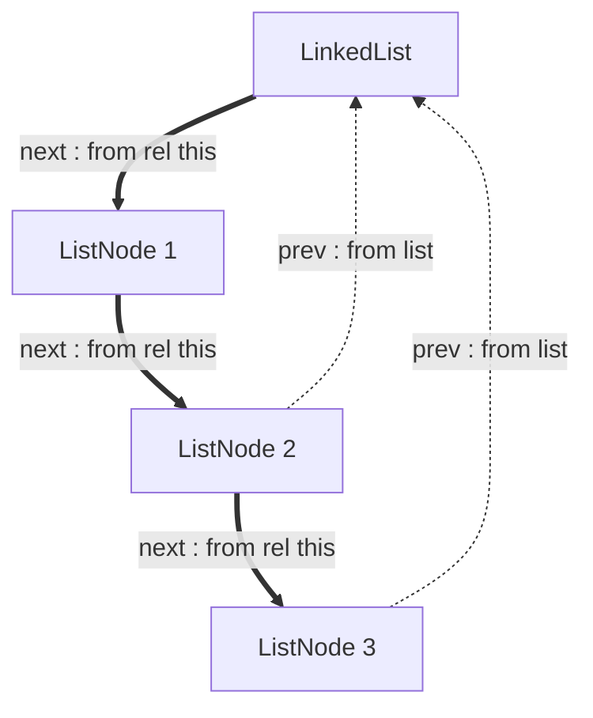

Two keywords describing use of fields:
- `from`
- `by`

These 2 describe whole semantics of references/owned, lifetimes, const/mutable/volatile.
Everything else is a use-site marker: `!`, `@`, `rel`, `del`.

# from
- Where the binding's storage lives
- Owned, inline: `from this`
- Owned, indirect, survives moves: `from rel this`
- Reference: `from <other place>`
- Back-references anchor to the owning root, never to the pointee
- Anchor must outlive the binding, and must already exist, so the graph cannot cycle
- Multiple regions: `A | B` = both must live (shorter), `A & B` = either suffices (longer)
- `|` is borrow-only, never owning. It is also the permissive side when an argument is checked
- `&` needs a refcount unless the deaths are statically ordered
- Covers lifetimes, ownership, references, pinning, arenas, allocators
- Called: region? source?
- Absorbs: `@` in declarations (derivable), the storage half of `ex`
- Used before: `ref`, now spelled `@`. Note `own` was never used; `from` itself is already in use for lifetime anchoring

# by
- Who may write the place
- One clause per declared place. `from` decides how many places exist
- Immutable: `by ()`, meaning nobody writes. Stronger than C `const`
- Normal variable: `by this`
- Exposed: `by mod System`, or any writer you cannot sequence by calling it
- Restricted field: `count : Unsigned64 by CountChange`
- On parameters: `use self by CountChange`, `use constValue by MemoCache`
- Operand is always a function set: function, module, or record of functions. Never a field name
- Viral. A caller that cannot declare the same set cannot make the call
- Called: writers? permission?
- Absorbs: `ex`, `ex to`
- Used before: `var`, `vol`, `mut`. Note `const` was never used; `ex` and `!` are current, not historical

# !
- Unchanged in meaning. Marks every write site, now as a suffix
- Resolves to the place at the last hop of the chain, which is what `by` is checked against
- Used before: `@`, as a prefix

# @
- Binds a reference to a value owned elsewhere. Initialization and assignment only
- Not a type constructor. In a declaration, `from` already says owned against reference
- Completes the set of ways a value reaches a binding: bare copies, `rel` moves, `@` aliases
- Used before: `ref`, also in declarations, which is the half `from` takes over

# rel
- Unchanged in meaning. Moves a value, so teardown does not run here
- `operator rel` is not overridable. Moves are always trivial relocation
- `use _operator rel` makes it private

# del
- Destroys a value in place. Teardown runs here
- Leaves the field invalid until it is assigned again. Not a conversion to `GarbageBytes`
- `operator del` is not overridable. Teardown is always the structural one
- `use _operator del` makes it private
- When private, a consuming function is required that calls `del` explicitly

# Privacy picks the discipline
- `operator new T(T)` private: no implicit copy, type is affine
- `operator del` private too: type is linear, must be disposed through a named function
- Both public: ordinary copyable value

---

# Reasoning and knowledge behind these decisions

Everything below was settled by argument rather than by reading the examples, so it is not
recoverable from the `.oura` files alone.

## Why `to` and `by` became one keyword

An earlier draft split the write permission in two: one word for changing what a reference points
at, another for changing the value every alias sees. That split is a habit borrowed from C, where
`const char *` and `char * const` exist only because the language cannot name *who* writes. Once
the permission is a list of subjects, the question of which pointer a write arrives through stops
mattering: a subject either may write the place, or it may not.

Two further arguments against the split:

- It does not scale. Two words cover indirection depth 0 and 1. A reference to a reference needs a
  third word, and the depth is unbounded, so it belongs in the grammar rather than the vocabulary.
- It creates two ways to say one thing. For an owned field the slot and the value are the same
  place, so both words would apply to it.

## Places, not pointers

Every `!write` resolves to exactly one place, and the last hop of the access chain names it. This
is what removes the need for the split:

```oura
tail'self! = @prev'tail'self   /*/ writes `tail`,  declared in LinkedList. Repointing.
value'tail'self! = v           /*/ writes `value`, declared in ListNode. Every alias sees it.
```

Each field is declared in exactly one record, so the two permissions live in two declarations and
never as two clauses on one line. When a reference genuinely needs to constrain its referent (the
referent's own declaration is too permissive, or the referent is generic), the constraint goes in
the type, by position:

```oura
_tail : (ListNode by ()) from head'self   /*/ may repoint, may not write the node
_tail : ListNode from head'self by ()     /*/ may not repoint, node stays writable
```

Inside the parentheses qualifies what the slot names, outside qualifies the slot. This works at any
depth.

Neither line spells `@`, because `from head'self` names a place other than `this` and that is
already the whole difference between owning and referring. The marker survives where the two
examples above cannot help, which is the moment a binding is filled:

```oura
cur! : ListNode = @head'self   /*/ alias, from LinkedList as written today
```

Here the declared type carries no `from` clause to read, and without the marker the line would be
indistinguishable from a copy. So `@` joins `rel` and bare assignment as the third answer to how
a value arrives: copy, move, alias. A useful side effect: the checked place is the last hop no
matter where `!` sits, so the open question about `data'self!` against `data!'self` becomes purely
cosmetic.

## Cyclic references

Ownership is acyclic, so the owning pointers form a tree and every node's storage transitively
lives in one root. A back-reference anchors to that root rather than to its target, which keeps
the `from` graph acyclic while the data cycles freely.



Thick edges own, dotted edges only anchor. The cost is precision rather than soundness: a
back-reference is valid as long as the whole structure is, not as long as its target node is, so
removing one node cannot invalidate references to just that node. This is the same trade arenas
make everywhere. Node removal stays inside methods that maintain the invariant, which is what `by`
is for.

## Shared regions

`&` and `|` combine sets of owners, not lifetimes. This is the same algebra they carry everywhere
else in the language: `from A & B` is rooted in both regions at once, and `from A | B` is rooted in
one of them without saying which. The lifetime is then a consequence rather than a definition, and
it falls out of how much the clause tells the checker. Knowing both owners buys the longer life,
knowing only that there is one of two buys the shorter.

The deciding argument is not the declaration but the call. A parameter's `from` clause is a
constraint that an argument has to satisfy, and there `|` has to be the permissive side, since an
argument rooted in either region should be accepted. Reading the operators as conditions on
liveness gives the opposite answer to reading them as owner sets, so only the owner-set reading is
correct; expect the other one to be a recurring source of confusion.

Two constraints that came out of teardown:

- `|` cannot own. If the owner is unknown, teardown would have to run at the first death, which
  frees the real owner's data while it is still held. So `|` marks a borrow spanning an unknown
  source.
- `&` is genuine shared ownership and needs a runtime count whenever the owners' deaths are not
  ordered at compile time. Teardown then fires on the last drop, which is the first dynamic
  teardown timing in the language.

Refcount cycles cannot happen. `from` may only name a place that already exists, and a fixed
declaration cannot later be assigned something rooted below it, so the ownership graph is a DAG by
construction. The `shared_ptr` leak class does not exist here.

## Threads

Sharing goes through atomics, and volatility anchors on atomic operations. This is sufficient only
with one addition: whatever is shared must own what it protects. An atomic makes one location
race-free, but a mutex is safe because unlocking publishes writes to *other* memory. If the lock
owns its payload through `from`, acquiring it transfers the region and the ordering edge comes for
free, with no ordering vocabulary anywhere in the language.

Given that, `by` never needs a "when" axis, because races are prevented structurally instead of
being described. Lock-free algorithms with hand-written acquire and release orderings stay library
primitives behind `# ExternC`.

## Reinterpreting bytes

Casting to and from bit and flag types covers `bit_cast`, unions, network headers and NaN-boxing,
because conversion is already an ordinary call. It is sound only for types whose fields are
transitively `from this`, since a field holding a reference means more than its bytes.

That condition is derived from clauses already written, so it is a refinement rather than a new
concept. Expressing it needs the refinement language to quantify over a record's fields, which
nothing in the examples does yet. That is the one genuine addition this requires.

References can never be punned, so tagged pointers stay out. Indexes make them unnecessary, since
the tag bits go in the index.

## Manual construction and destruction

The two halves of the state already exist: `GarbageBytes` for storage declared without an object in
it, and the typed value for storage with one. Construction is already a call, and `del` supplies the
missing direction by destroying in place.

What `del` leaves behind is worth stating precisely, because the obvious reading is wrong. It does
not turn the field into `GarbageBytes`, and the field's declared type does not change at all. What
changes is only what the checker knows: reading the field is invalid until something assigns it
again. That keeps the two mechanisms apart. `GarbageBytes` is a statement about layout, written in a
declaration, as `_PreallocBuffer.freeItems` does; `del` is a fact in the definite assignment
analysis, the same one that governs the partial moves below.

Slot liveness inside a buffer is controlled by refinements and type-level `if`, at two prices. When
the live slots are a prefix or a suffix, liveness is a function of a counter and stays fully
static, which is what `_PreallocBuffer` already does. When they are scattered, as in a free-list
arena, the predicate depends on runtime data, so each access becomes a checked narrowing rather
than a proof.

Partial moves are permitted when the field is re-initialized later. Two conditions:

- On every path, including error paths.
- Before the scope ends, not merely before the next read. A hole nobody reads is still a hole that
  structural teardown walks.

This is the same definite assignment analysis that already fills `res` in `Bounds.sum2Items`.

## Copyable, affine, linear

Copying is a call to `operator new T(T)`, so privacy on it is what removes the ability to
duplicate. Privacy on `operator del` removes the ability to drop. Together they give three
disciplines:

| `operator new T(T)` | `operator del` | Discipline | Meaning                                   |
| ------------------- | -------------- | ---------- | ----------------------------------------- |
| public              | public         | copyable   | ordinary value                            |
| private             | public         | affine     | cannot duplicate, still drops on its own  |
| private             | private        | linear     | must be disposed through a named function |

The property propagates with no extra rule. A container's copy constructor needs each item's copy
constructor, so a stack of files is non-copyable automatically, while moves inside the container
keep working because they go through `rel` and never copy.

A destructor is then an ordinary function that consumes the value and calls the private `del`:

```oura
close(file : File) => { del file }   /*/ del is private to this module
```

The caller writes `close(rel file)`. Nothing user-written ever runs implicitly here: the only
teardown the compiler inserts on its own is the structural `del`, which recurses into fields and
stops there.

Two consequences worth knowing. Teardown of container items calls `del` structurally even when it
is private, so linearity leaks through generic containers, which is a hole every language with
this design accepts. And a private `del` is what makes "commit or roll back, never just drop"
expressible for transaction handles.

## No implicit exits

Unhandled unions are forbidden, so every error is handled at the site and every exit is written in
the source. There is no automatic unwinding: what a compiler does with the stack is an
optimization of paths the programmer already wrote.

Linear values are dropped explicitly before each return, including returns that leave nested
blocks by name. Scopes nest lexically, so a value in an enclosing scope is always nameable from
the block exiting past it, and the compiler knows which scopes an exit crosses, so it can check
this.

The verbosity is bounded. Affine values still drop on their own, so only linear types need written
drops, and those are rare by construction: files, sockets, transactions. The ceremony lands exactly
where the guarantee was wanted.

## Feature parity with C and C++

Behavioural parity is close to complete, because an arena plus indexes rewrites almost anything.
An object in two intrusive lists holds two indexes and mutates through one owner, so the aliasing
becomes sequential. A doubly-linked list with stable indexes into a free list gives per-node
invalidation. Union-find with path compression works the same way. Custom allocators fall out of
`from` directly, since it is already a region system.

What does not survive is code that computes with addresses:

1. `container_of` and `offsetof`, the reverse of `from`, needed by intrusive containers.
2. Byte reinterpretation beyond what flat types allow.
3. `void *` type erasure at C ABI boundaries, where recovering the type is an unchecked assertion.

All three reduce to reinterpreting bytes, so one well defined unsafe core covers them.

The real cost is code shape rather than expressiveness. Graph-shaped structures get written
arena-style, which adds an indirection where C would follow a pointer, and asks people to leave
the idiom they arrive with. That is a deliberate choice, not a discovery to leave for users.

## Trust points

`use constValue by MemoCache` is the one place the checker takes the programmer's word. It says a
write is confined to a named set and therefore unobservable to the caller, which cannot be
verified. If the cached field is readable by any other route, hidden mutation is back. It also
races when the value is reachable from two threads, which is a live bug class in C++ for exactly
this pattern.

## What was dropped along the way

- `ex` as a separate keyword. It is `by` with a writer you cannot sequence by calling it.
- `@` in declarations. `from this` against `from <other>` already distinguishes owned from
  reference. The marker itself stays, for initialization and assignment.
- `to` as a third axis. Merged into `by`.
- Per-reference const qualifiers. Replaced by naming subjects.
- A pinning concept. `from rel this` covers it.
- `mutable` members in the C++ sense. Replaced by `by MemoCache` with explicit cache writes.
- Unique addresses for records. `?=` is structural, and anywhere C compares pointers, indexes are
  compared instead.

---

# Changes required to the existing examples and rules

These are repository-wide sweeps, not local edits.

**`@` leaves declarations and stays in expressions.** Three declarations lose it:
`Bounds.oura:12`, `LinkedList.oura:10` and `LinkedList.oura:68`. Six initialization and assignment
sites keep it unchanged: `LinkedList.oura` lines 24, 28, 42, 50, 58 and 60. Line 24 already writes
the settled form, since `cur! : ListNode = @head'self` puts the marker on the value rather than
on the type.

One case does not survive the sweep on its own. `Bounds.oura:12` declares `arr : @IntList`, and a
parameter is exactly where the region belongs to the caller and cannot be named from inside the
callee, so dropping the marker leaves nothing saying the argument is borrowed rather than consumed.
`from(out)` in `Ownership.oura:20` shows the shape an answer would take.

**`ex` becomes `by`.** `RandVec.oura` has five sites. `ex deviceRandom` becomes a `by` clause
naming the writing module, `use ex console!` becomes a parameter with a `by` clause, and `main ex`
needs a decision of its own, because inbound effect on a function is a different fact from a
writable place.

**`ex to` disappears.** The form documented in `README.md` never reached a `.oura` file, and its
job is now `by`.

**`Ownership.oura:25` loses its teardown hook.** It defines `operator rel(use self!) => { free(rel
data'self) }` under the comment "Runs where a binding dies unmoved", and since neither operator
is overridable now, renaming it to `operator del` is not
the fix. Custom teardown has two replacements instead. Memory reached through `from rel this` is
released by whatever that clause names as its manager, so the explicit `free` disappears with the
declaration that made it necessary. Resources that are not memory become linear through a private
`operator del` and are disposed by a named function. Whether those two cover every case is the last
open question below.

**`README.md` Mutation section needs rewriting.** It currently states that a field declares
nothing about writability. `by` on a field contradicts that. The line to draw is that `by` is an
invariant tool, not a privacy tool: `_` still handles privacy, and `by` names who may break the
coupling between fields. `SmallStack`'s `count : Unsigned64 by CountChange` is the motivating case,
since changing the count invalidates the buffer.

**Read-public, write-restricted needs no new feature.** Fields and functions are the same
declaration, so `_count : Unsigned64` with `count => count'self` leaves every use site
(`count'self`, `count'list`) unchanged. The accessor pattern is free here in a way it is not in
C++ or Java.

**Four open questions in `README.md` are now settled** and their entries should be deleted:

- Copying is a call to `operator new T(T)`, never automatic for types that close it.
- Partial moves are permitted with re-initialization on every path before the scope ends.
- The `data'self!` against `data!'self` question is cosmetic, since the checked place is the last
  hop either way.
- The `ex to` checking rules are moot, because the form is gone.

**Errors found in the current files, unrelated to this design:**

- `SmallStack.oura:125` declares `_items : OptiBuffer`, but every body reads and writes
  `data'self`, and the final constructor writes `data = ...`. `_ensureCapacity` uses both names in
  the same function. Referenced without the underscore, `_items` also collides with the `items`
  accessor on line 78.
- `LinkedList.oura:68` declares `prev: @ListNode | None` with no `from` clause, which is the
  anchor the back-reference rule needs.
- `LinkedList.oura:36` has a stray `.` in `next'tail'self. = ListNode(`, and the write is unmarked.
- `LinkedList.oura:44` writes `head'self` unmarked.
- `LinkedList.oura:54` declares `=> Item` but never returns. `tail'self! = @prev'tail'self`
  appears twice, and the second reads `prev` of the new tail. The empty-list case never clears
  `head'self`.

# Open questions

- `main ex`: inbound effect on a function. `by`, `from`, or left alone?
- `by` on a local: written as `by this`, or does `!` at declaration remain the whole story?
- Global with no `by`: immutable, or module-writable?
- Shared ownership: keep `&` and `|`, or give the refcounted case its own spelling, since one is
  static and the other is not?
- Quantifying over a record's fields in a refinement: what syntax?
- Marked propagation form to cut the `else` boilerplate, now that unhandled unions are forbidden?
- `by ()` on a field of an otherwise writable record: legal, or contradiction?
- Generic referents: where does a `by` inside the parentheses attach when the type is a parameter?
- Borrowed parameters: what replaces `@` in `Bounds.oura:12`, given that the caller owns the
  region and the callee cannot name it?
- Custom teardown: with neither `rel` nor `del` overridable, are managed `from rel this` and linear
  disposal enough, or does something still need a hook?
