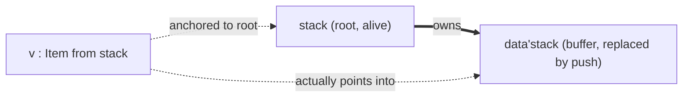

# Analysis of `RefinedIdea.md`

This document reviews the `from` / `by` design on four counts: internal consistency, readability at
a glance, expressive parity with C and C++, and freedom from undefined behaviour. Every claim is
backed by an example, most of them taken from the existing `.oura` files. Nothing here changes the
design; where a rule is missing, the rule that would close the gap is proposed and marked as such.

Companion documents: `CCppConversion.md` lists C and C++ memory constructs with their Oura
spelling, and `CCppUnportable.md` lists the ones that have no direct port.

## Summary

| Question                          | Verdict                                                                                                                |
| --------------------------------- | ---------------------------------------------------------------------------------------------------------------------- |
| Consistent and correctly explained | Mostly. Two rules the text relies on are never stated, and "viral" is used in two incompatible senses.                |
| Intuitive at a glance             | `from this`, `from X`, `by ()`, `by mod M`, `by Set` read well. `from rel this` does not. Owned versus reference is signalled by a word choice rather than by a sigil, which is learnable but not glanceable. |
| Parity with C and C++             | Behavioural parity holds, with the caveats in `CCppUnportable.md`. The largest ergonomic loss is the absence of any user teardown hook. |
| No UB or memory unsafety          | Not yet. Two holes exist: aliases are never invalidated by a write to their anchor, and trivial relocation breaks references into inline siblings. Both have known fixes. |

## 1. Consistency

### 1.1 What holds together

**Last hop resolves the place.** The rule removes the `const T *` versus `T * const` split
cleanly, and the existing files already obey it without knowing:

```oura
tail'self! = @prev'tail'self     /*/ LinkedList.oura:58, writes tail, a slot of LinkedList
count'self! + 1                  /*/ SmallStack.oura:92, writes count, a slot of SmallStack
item(data'self!, index) = value  /*/ SmallStack.oura:85, writes data, the container
```

**`&` and `|` keep their meaning from the type algebra.** `Int32|OutOfBoundsError` accepts either
member, and a parameter `x from A | B` accepts an argument rooted in either region. `Vector3 &
non'ZERO3` demands both, and `x from A & B` demands an argument rooted in both. The lifetime
consequence (`&` longer, `|` shorter) follows from the set reading and is never a separate rule.
This is consistent; the text is right that the "condition on liveness" reading must be
discouraged.

**`by` operands drop field names.** `README.md` allowed `ex to` to list a field, meaning "this
field holds a reference the ownership rules do not track". With `from` tracking every reference,
that case no longer exists, so restricting `by` to function sets is a consequence, not a loss.

**Privacy selects the discipline.** The three-row table (copyable, affine, linear) uses no new
mechanism. `close(rel file)` is forced by the existing rule that a parameter consumes a copy
unless `rel` is written, and a private `operator new File(File)` makes the copy impossible.

**Definite assignment covers `del` and partial moves.** `Bounds.sum2Items` already fills `res` on
both branches; extending the same analysis to "a `del`-ed or `rel`-ed field must be refilled on
every path before scope end" adds no second mechanism.

### 1.2 Rules the text relies on but never states

**R1: What a write to a reference slot does depends on the right-hand side.** Both of these are
"a write whose last hop is `tail`":

```oura
tail'self! = @prev'tail'self   /*/ repoints the slot
tail'self! = ListNode(...)     /*/ ...and this? overwrite the node through tail, or an error?
```

The design handles it for a parenthesised type: `(ListNode by ()) from head'self` says the slot
may be repointed and the node may not be written. So there are two permissions, one per level,
yet both writes above name the same last hop. The only thing that can pick between them is the
form of the value: `@e` writes the slot, a bare value or `rel e` writes the referent. That is
exactly C's `p = q` versus `*p = v`, folded into the marker on the right. It is a good rule, and it
should be written down, because without it `p! = 2` on a `p : Int32 from a` is ambiguous.

**R2: A `!` write to a place invalidates every reference anchored in that place.** The text
states invalidation on move (`Ownership.oura:76`, "c is gone, and view with it") and on layout
change (`SmallStack.oura:92`, "invalidates data'self"), but never for a plain write. Section 4
shows why this is the difference between safe and unsafe.

**R3: What "the same set" means in the virality rule.** The summary says "A caller that cannot
declare the same set cannot make the call." Read literally, `Player.oura` breaks:

```oura
action(myPlayer!, otherPlayer!)   /*/ calls attack
attack(attacker!, target!)        /*/ calls hurt
hurt(targetPlayer!, amount)       /*/ writes health'targetPlayer!
```

If `health : Real by Damage` and virality means "every function on the call chain must be in
`Damage`", then `action` and `main` must join `Damage`, and the set is useless. The reading that
keeps the design usable is the last-hop rule applied per function:

- `hurt` writes `health'targetPlayer`, last hop `health`, declared `by Damage`. `hurt` must be in
  `Damage`.
- `attack` writes `target` by passing `target!`, last hop `target`, declared `target!` in
  `attack`'s own parameter list. `attack` may write its own `!` parameter.
- `action` likewise.

Under this reading, `!` on a parameter is the `by` declaration for that hop: `use self!` is
`use self by <this function>`. Virality is then bounded to parameter declarations, which the
`!` sweep already put on every signature. This is consistent and should be the stated meaning.

The `use constValue by MemoCache` case is where the two readings diverge. If the caller's own
declaration of the argument must list `MemoCache` as well (the viral reading), the write is
declared by the owner and there is nothing to trust; the section "Trust points" is then about
thread races only. If it need not (the encapsulated reading), the call site `memoize(constValue)`
carries no `!` while the callee writes, which contradicts "Marks every write site". Either reading
works; the text currently describes both. Pick one.

### 1.3 Contradictions inside the text

**`del` on a shared owner.** "`del` destroys a value in place. Teardown runs here" cannot hold for
a value `from A & B` with a runtime count. `del` on one owner must decrement, and teardown runs
on the last drop. Either `del` is defined as "drop this owner's claim" (which is teardown only when
the claim is the last one), or `del` is forbidden on `&`-owned places.

**Linearity leaking through containers is not forced.** The text propagates copyability with "A
container's copy constructor needs each item's copy constructor" and then says linearity does not
propagate, "which is a hole every language with this design accepts". The same rule closes it: a
container's structural `del` needs each item's `del`, so a container of a linear type has a
private `del` and is itself linear. Nothing new is required, and the hole disappears.

**Missing "anyone" writer set.** The listed operands are `()`, `this`, a module, a function set.
`Player.oura` writes `health'targetPlayer!` from a free function outside the record, which is C's
plain struct. The field default must therefore be "anyone holding the record writable", and that
set has no spelling. Whether it is `by Any`, `by this` with `this` meaning the holder, or the
default that needs no clause, it has to be named, since the open question about globals cannot be
answered without it.

**`by ()` on a field of a writable record** is already answered by the last-hop rule and should not
be listed as open: `x! = T(...)` writes `x`, not the field, so the field's clause is never
consulted. Only `id'x! = 5` is rejected. This is the same reasoning that lets a record with a
`by ()` field be moved with `rel`.

**Exposure lost a fact in the merge.** `ex` said "a writer that does not go through a call". `by
mod System` names a writer, but a module is a set of functions, and the compiler sees no call to
any of them between two reads. Something must still say that the set writes asynchronously,
otherwise reads get cached. Either a module marked `# ExternC` counts as asynchronous, or `by`
needs a rule "a set containing an external function set is never sequenced". The rule is small
but it is the whole content of the old keyword, and it is not in the text.

### 1.4 Errors in the change list

- The `@` sweep lists six retained sites in `LinkedList.oura` (24, 28, 42, 50, 58, 60). Line 38,
  `prev = @tail'self`, is a seventh.
- The five `ex` sites in `RandVec.oura` include line 35, `(ex -> : ArrayList'Int64)`, an `ex` on a
  function type. It needs the same decision as `main ex` and is not mentioned.
- `README.md`'s Ownership section states "aliasing never arises, so lifetimes are a question about
  escaping return values only". `@` aliases in locals and `from A & B` both introduce aliasing.
  The section must be rewritten together with Mutation; the change list names only Mutation.

## 2. Intuitiveness at a glance

Tested against four readers: a beginner, a C programmer, a Rust programmer, a Python programmer.

| Form                        | Reads as intended                                | Where it fails                                                                            |
| --------------------------- | ------------------------------------------------ | ----------------------------------------------------------------------------------------- |
| `from this`                 | Yes, all four. "The storage comes from here."     | Python readers see `from` as import for a moment; it passes.                             |
| `from head'self`            | Yes. "Lives inside head."                        | A C reader does not see a pointer. The only signal is that the word after `from` is not `this`. |
| `from rel this`             | No.                                              | `rel` means "move it away" everywhere else. Here it means "owned, but not inline". Every reader has to be told. |
| `from A & B`, `from A \| B` | Rust readers yes, others after one explanation.  | The lifetime consequence being inverted from the naive reading is admitted in the text.  |
| `by ()`                     | Yes. "Written by nobody."                        | None.                                                                                     |
| `by this`                   | Partly.                                          | Beginners ask what `this` is on a local. Open question in the text.                      |
| `by mod System`             | Yes, all four. Better than `volatile`.           | None.                                                                                     |
| `by CountChange`            | Yes. Reads like a `friend` list.                  | None.                                                                                     |
| `(ListNode by ()) from x`   | Yes, after R1 is known.                          | Without R1 the inside/outside placement looks decorative.                                 |
| `x! = @y` vs `x! = y`       | Yes once told. Same shape as `c = rel a`.        | None.                                                                                     |
| `del x`                     | Yes.                                             | "Leaves the field invalid, not GarbageBytes" needs the paragraph the text gives it.      |

The one structural weakness: the difference between an inline value and a reference is carried by
*which name* follows `from`, not by any mark. In C, Rust and Python that difference is the most
visible thing on a declaration (`*`, `&`, or nothing at all). Compare:

```oura
value : Item                        /*/ inline, from this elided
next  : ListNode from rel this      /*/ owned, heap
prev  : ListNode from list          /*/ reference
```

Three storage kinds, and the only difference is one word in the clause. It is learnable. It is not
glanceable. This is a deliberate trade for having one keyword, and it is worth stating as such in
`README.md` so readers stop looking for the sigil.

## 3. Expressive parity with C and C++

`CCppConversion.md` walks the constructs one by one. The short version:

**Covered by existing mechanisms with no addition:** values, `const`, pointers to owned data,
heap ownership, `unique_ptr`, `shared_ptr` without cycles, arenas and custom allocators as
regions, out parameters, references returned into a parameter, views and spans, `volatile`,
`mutable` caches, `friend`, deleted copy constructors, RAII for memory, tagged unions, function
pointers and closures, flexible array members, VLAs, manual construction and destruction, bit
casts of flat types, exceptions, virtual dispatch, mutex-protected sharing.

**Covered with a change of shape:** doubly linked lists, trees with parent pointers, intrusive
containers, union-find, observer graphs. All become arena plus index, as the text says. `weak_ptr`
becomes a generation-checked index.

**Not covered:**

1. User teardown hooks. Neither `rel` nor `del` is overridable, so `lock_guard`, scope guards,
   `defer`, and any destructor that does non-memory work become linear types with an explicit call
   on every exit path. The guarantee is kept; the ergonomics of RAII are lost. This is the largest
   practical cost and the text lists it as an open question.
2. Custom move constructors. `rel` is always a bit copy, so a type that patches pointers on move
   (small-string optimisation with an interior pointer, an intrusive node fixing its neighbours) has
   to be redesigned. Section 4 shows this is also a safety requirement.
3. Address computation: `container_of`, `offsetof`, tagged pointers, `void *` erasure. Admitted.
4. Non-local exits: `longjmp`, `goto` into cleanup. `out` leaves a named lexical block only.
5. Peer references created after the referrer. `from` must name an existing place, so an object
   cannot hold a reference to a sibling constructed later. The rewrite goes through a common root.

One item the text claims and does not show: "Custom allocators fall out of `from` directly". A
field `from rel this` names no allocator, and there is no example of an owned field whose memory
comes from a named arena. The obvious spelling, `_data : Buffer'Item from rel arena'self`, would
mean the arena owns the buffer, making `data` a reference, not an owner. Either owned-in-arena is
the same thing as a reference into an arena (defensible, since the arena frees it), or a manager
clause is missing. Listed as a question below.

## 4. Undefined behaviour and memory safety

### 4.1 Hole: aliases survive writes to their anchor

A back-reference is "valid as long as the whole structure is". The text calls this a precision
cost, not a soundness cost. It is a soundness cost unless R2 is added. Three examples from the
existing files:

```oura
/*/ 1. LinkedList.oura. Alias into a node, then remove the node.
cur = @item(list, 3)
pop(list!)               /*/ frees the last node. cur is anchored to list, list is alive.
value'cur                /*/ reads freed memory
```

```oura
/*/ 2. LinkedList.oura:10 and :44. tail is anchored in head. head is replaced.
head'self! = None        /*/ tail : ListNode from head'self still holds the old node
```

```oura
/*/ 3. SmallStack.oura:91. View into the buffer, then push.
v = @item(stack, 0)      /*/ item returns : Item from self, anchored to stack
push(stack!, 7)          /*/ rel data'self, concat into a new buffer. Old buffer is gone.
v                        /*/ dangling
```

In all three the checker sees a reference anchored to a root that is still alive. The fix is the
rule Rust uses: a `!` on a place ends the life of every reference anchored in that place, or in
anything the place owns. Applied to the three cases:

- `pop(list!)` kills `cur`. Correct.
- `head'self! = None` kills `tail`. `push` must then reassign `tail` before returning, which
  `LinkedList.oura:50` already does.
- `push(stack!, 7)` kills `v`. Correct, and over-conservative in exactly the way Rust is.

The cost: `for node in items'self { push(self!, x) }` is rejected, since the generator holds
`cur` anchored in `self`. That is the iterator-invalidation bug class, rejected at compile time.
The rule also makes "Node removal stays inside methods that maintain the invariant" true, because
those methods take `self!` and no outside alias can be alive across the call.



The dotted edge on the right is what the checker does not see. R2 makes the write to `stack`
sever the left dotted edge, which is enough.

### 4.2 Hole: trivial relocation with references into inline siblings

"Moves are always trivial relocation" and "Anchor must outlive the binding" are both satisfied
by this record, which is nonetheless unsound:

```oura
Parser = proto struct(
    _buf    : Array(Byte, 1024)          /*/ from this: inline
    _cursor : Byte from buf'self         /*/ reference into the inline sibling
)

p2 = rel p1                              /*/ bit copy. cursor'p2 points into p1's dead frame
```

`from rel this` is said to cover pinning, but it pins the *pointee*, and here the pointee is
inline by choice. Two possible rules, either of which closes it:

- A reference anchored in an inline sibling makes the record non-relocatable, so `rel` is
  rejected on it and it can only be constructed in place.
- A `from` clause may name a sibling only if that sibling is `from rel this`.

The second is simpler and matches what `LinkedList.oura:10` already does (`tail` points into
`head`, and `head` is `from rel this`). Recommended.

### 4.3 Hole: `&` sharing across threads

"Whatever is shared must own what it protects" handles locks. It does not say what happens to a
value `from A & B` when A and B live on different threads:

```oura
shared = Counter(0)                      /*/ from rel this & worker, say
spawn(worker!, (use shared by this) -> { count'shared! + 1 })
count'shared! + 1                        /*/ two writers, no lock, no ordering
```

Nothing in `from` or `by` distinguishes this from two owners on one thread. The rule that closes
it is again small: a value crossing a thread boundary is either moved (`rel`), or `by ()` with an
atomic count, or owned by a lock. That is `Send`, `Arc<T>` and `Mutex<T>` in three clauses, and
each is checkable from declarations already written.

### 4.4 What is sound as described

- **Ownership cycles.** `from` names lexically earlier places, so two instances of one declaration
  cannot anchor to each other. The DAG claim holds.
- **`del` then read.** Definite assignment rejects it.
- **`GarbageBytes`.** Typed as bytes, never as the value, so uninitialised reads are type errors.
- **Bit casts.** Sound for transitively `from this` types, as stated. One addition: a cast *into* a
  type with invalid bit patterns (`Bool`, a refined integer, a flag type with reserved bits) must
  be a checked narrowing through `as`, not a plain call, or a `Bool` holding `2` is UB in the
  C++ sense. Since conversion is already a call that may return a union, this is a library rule,
  but it should be written where bit types are introduced.
- **Non-local exits.** Linear values must be dropped before each `out`, and the compiler knows
  which scopes an exit crosses. Sound.
- **`|` borrows.** Both regions must live, so the borrow is never longer than its true source.
- **References cannot be punned.** Tagged pointers are excluded at the type level.
- **Layout dependence.** `count'self! + 1` invalidating `data'self` is derivable from the
  type-level `if`, so the comments in `SmallStack.oura` are checks, not reminders.

### 4.5 Outside the design's scope, still UB in C

Integer overflow, division by zero, shift width, out-of-range enum values, and stack exhaustion
are not addressed by `from` and `by`. Refinements (`Unsigned64 where this < count`) and checked
`as` narrowing cover the first four when used. Stack depth is not covered by any language in this
family. Worth a sentence in `README.md` so the safety claim is scoped correctly.

## 5. Recommended additions, in priority order

1. State R2 (write to anchor invalidates references). Without it the design is unsound.
2. State R1 (right-hand side chooses slot versus referent). Without it `p! = v` is ambiguous.
3. Forbid `from <sibling>` unless the sibling is `from rel this`. Closes 4.2.
4. Fix "viral" to mean the per-hop reading in R3, and decide whether `by S` on a parameter
   requires the owner's declaration to list `S`.
5. Propagate private `del` through containers the way private copy already propagates.
6. Define `del` on a `&`-owned place.
7. Name the universal writer set, then answer the global and local defaults from it.
8. Restore the asynchronous-writer fact that `ex` carried.
9. Add the thread-crossing rule from 4.3.
10. Rewrite the "aliasing never arises" paragraph in `README.md` alongside Mutation.

## Unresolved questions

- R1 confirmed: `p! = v` writes referent, `p! = @e` repoints, `p! = rel v` moves into referent?
- R2 confirmed: any `!` on X kills refs anchored in X or below? Generators included?
- Viral `by`: owner must declare the set, or callee membership suffices?
- Universal writer set: spelling? Field default = that?
- Owned-in-arena: `from rel arena` is a reference or an owner? Manager clause needed?
- Standalone recursive types (tree node outside any list): anchor spelled how? `from root`? Region parameter?
- `del` on `from A & B`: decrement or forbidden?
- Async writer: `# ExternC` on the module, or a flag on `by`?
- Thread crossing: rule as in 4.3, or lock-only?
- Bit cast into refined/flag types: always through `as`?
- `ex ->` on function types: same fate as `main ex`?
- Static storage region for literals and globals: `from mod`?
